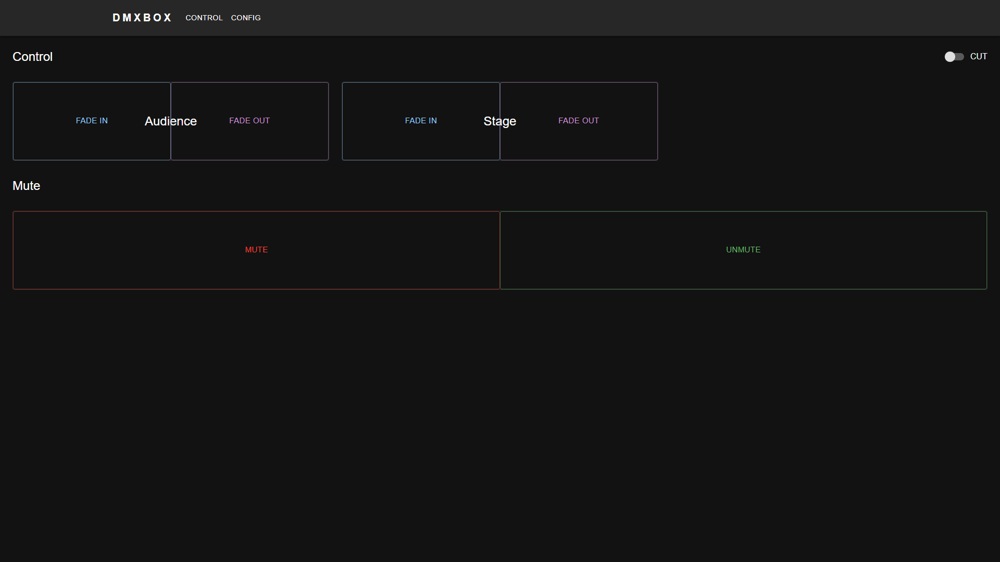
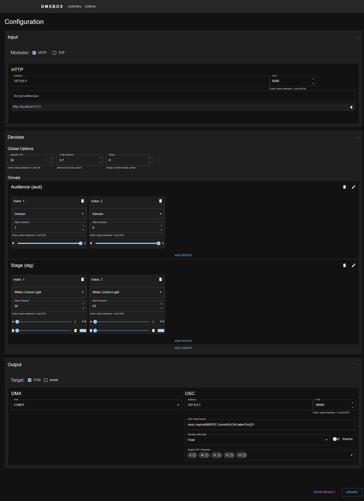

# DMXBOX

[English](README.md)

DMXBOXはDMX照明制御システムです。Webベースのフロントエンドで設定・制御が可能であり、HTTP/TCP入力、DMXハードウェア/Art-Net出力、デバイスモデル（dimmer, WC Light）、グループ管理をサポートします。
また、OSCを用いてミキサーなどのミュート処理が行えます。

## 主な機能

- **バックエンド (Go)**:
  - DMXサーバー（FPS制御、フェード効果）。
  - DMXハードウェア（FTDI等）、Art-Net出力対応。
  - HTTP API（設定、コンソール、DMX制御、OSCマッピング）。
  - TCPサーバー（カスタム入力）。
  - OSCサーバー（ミキサー制御）。
  - モジュールアーキテクチャ（configで有効/無効）。

- **フロントエンド (React + TypeScript + Vite)**:
  - デバイス管理：グループ、モデル（dimmer, WC Light）。
  - 入出力設定：HTTP, TCP, OSC, Art-Net, DMX。
  - コントロール：Mute, Fade, Error表示。
  - レスポンシブUI、テストユーティリティ。

- **設定**: JSONベース（ポート、デバイス、モジュール）。
- **テスト**: バック/フロントユニットテスト。
- **ビルド**: Taskfileでクロスプラットフォーム。

## 前提条件

### Task Runner
- [Task](https://taskfile.dev/)

### Backend
- [Go 1.21+](https://go.dev/)
- [swag](https://github.com/swaggo/swag) (APIドキュメント用)
- [Air](https://github.com/air-verse/air) (ホットリロード、オプション)

### Frontend
- [Node.js 18+](https://nodejs.org/)
- [yarn](https://yarnpkg.com/)

## クイックスタート

1. リポジトリをクローン。
2. `task dev` で開発開始（バックエンド + フロントエンド ホットリロード）。
3. `http://localhost:5173` を開く（フロントエンド）。
4. UIまたは `backend/config.json` で設定。

## 設定

メイン設定: `backend/config.json`（デフォルトから自動生成）。

デフォルト例:
```json
{
  "modules": {
    "http": true,
    "tcp": true
  },
  "output": {
    "target": ["console"],
    "dmx": {"port": "COM1"},
    "artnet": {"addr": "2.255.255.255/8", "universe": 0}
  },
  "http": {"ip": "127.0.0.1", "port": 8000},
  "tcp": {"ip": "127.0.0.1", "port": 50000},
  "dmx": {
    "groups": {
      "group1": {
        "name": "Group 1",
        "devices": [{"model": "dimmer", "channel": 1}]
      }
    },
    "fadeInterval": 0.7
  },
  "osc": {"ip": "127.0.0.1", "port": 8765, "format": "/yosc:req/set/MIXER:Current/InCh/Fader/On/{}/1"}
}
```

- `modules` でモジュール有効化。
- DMXグループ/デバイス定義。
- HTTP API経由で変更保存。

## 開発

- `task dev`: Air (backend) + Vite (frontend)。
- `task test`: 全テスト実行。
- `task test_watch`: ウォッチモード。

## ビルド

クロスプラットフォーム対応（Windows/Linux/macOS）。ただし、テスト済みはWindows/Linuxのみです。

- `task build`: 現在プラットフォーム用ビルド。
- `task build_all`: 全ターゲット（Win/Linux）ビルド。
`dist/` に出力。

`task default` でディレクトリ作成 + ビルド + configコピー。

## API

`http://localhost:8000`

エンドポイント:
- `/api/v1/config`: 設定 GET/POST。
- `/api/v1/console`: コンソール出力。
- `/api/v1/dmx`: DMX制御。
- `/api/v1/health`: ヘルスチェック。
- `/api/v1/osc`: OSCマッピング。

APIの詳細については、 `http://localhost:8000/docs/index.html` をご確認ください。

## スクリーンショット

### コントロール画面


### 設定画面


## テスト

- Backend: `cd backend; task test`
- Frontend: `cd frontend; task test`
- すべて: `task test`

## アーキテクチャ

- **main.go**: モジュール管理（DMX, HTTP, TCP, OSC）。
- チャネル経由メッセージング。
- SIGINTで正常シャットダウン。

## サポートデバイス

- `dimmer`: シンプルな調光制御（単一チャンネル）。
- `wclight`: WC Light（ホワイトカラー調整照明）。
  - チャンネル構成: [cool（寒色）, warm（暖色）, flash（未使用: 常に0）]

## トラブルシューティング

- 設定ロード失敗: JSON構文確認（`backend/config.go`のLoad関数）。
- DMXハードウェア: ポート確認（Windows: COM1等、Linux: /dev/ttyUSB0等）。
- ポート競合: configのIP/Portを変更。

ログ（JSON形式、slog使用）を確認。

## ライセンス
[LICENSE](LICENSE) を参照。