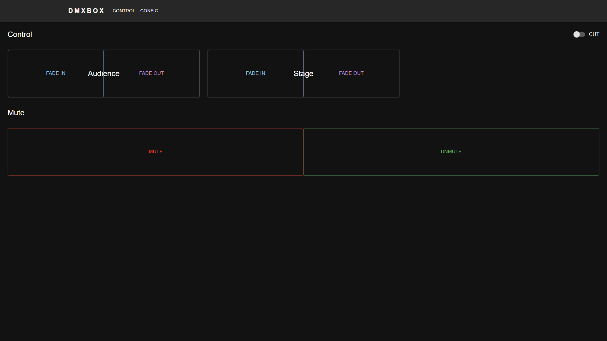
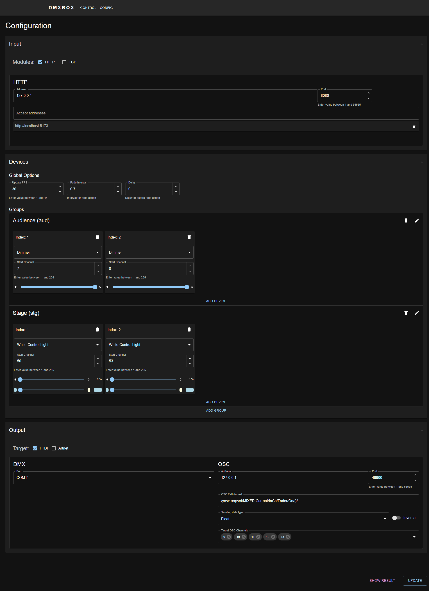

# DMXBOX

[日本語](README.ja.md)

DMXBOX is a DMX lighting control system with a browser-based interface. A Go backend serves the HTTP API and production frontend, allowing a release to run as a single application on one computer.

It supports HTTP and TCP control input, FTDI-compatible DMX hardware and Art-Net output, group-based fades, and OSC mute control for audio mixers.

## Features

- 512-channel DMX output with configurable frame rate
- Fade, cut, mute, and unmute controls
- FTDI-compatible serial DMX, Art-Net, OSC, and console output
- Dimmer and white-color light device models
- Browser-based configuration and control
- Windows x86-64, Linux x86-64, and Linux ARM64 release targets
- Automated frontend and backend tests

## Quick Start

For a release, keep the executable and `static/` directory together. If you already have a `config.json`, place it there as well. Run the executable from that directory, then open:

```text
http://localhost:8080/gui/
```

If `config.json` does not exist, DMXBOX creates a default configuration. Review the output and serial-port settings before connecting production lighting hardware.

For local development:

```sh
task dev
```

Then open `http://localhost:5173`.

## Documentation

- [English documentation](docs/en/README.md)
- [User Guide](docs/en/user-guide.md) — installation, operation, updates, and troubleshooting
- [Configuration Reference](docs/en/configuration.md) — complete `config.json` structure and examples
- [TCP Protocol](docs/en/tcp-protocol.md)
- [Lighting and Output Specifications](docs/en/lighting-specifications.md)
- [Developer Guide](docs/en/developer-guide.md) — architecture, development, testing, building, API, and releases
- [日本語ドキュメント一覧](docs/ja/README.md)

Interactive API documentation is also available while the backend is running:

```text
http://localhost:8080/docs/index.html
```

## Screenshots

### Control



### Settings



## License

DMXBOX is licensed under the [MIT License](LICENSE).
